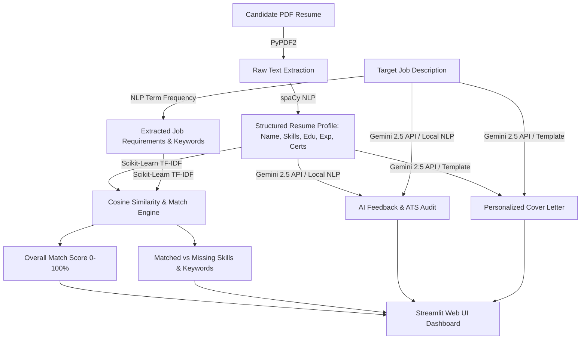

# 🎯 AI Resume Analyzer & Job Match Assistant

> An intelligent, local-first web application built with **Python**, **Streamlit**, **spaCy NLP**, **Scikit-Learn**, **PyPDF2**, **Pandas**, and **Google Gemini API** to analyze resumes, evaluate candidate-job fit, audit ATS compliance, pinpoint skill gaps, and generate tailored cover letters.

---

## 📋 Abstract

In today's competitive job market, candidates often struggle to understand why their resumes fail to pass Applicant Tracking Systems (ATS) or catch recruiter attention. The **AI Resume Analyzer & Job Match Assistant** bridges this gap by automatically extracting structured candidate details from PDF resumes, comparing them against specific job postings using NLP and TF-IDF cosine similarity, highlighting missing skills and domain keywords, providing targeted AI improvement recommendations, and generating personalized cover letters.

---

## ❓ Problem Statement

Most online resume reviewers are either paywalled, send sensitive resume data to untrusted third-party servers, or lack objective quantitative matching. Job seekers need a **local-first, privacy-preserving, transparent tool** that calculates actionable ATS match metrics, provides objective skill gap feedback, and offers AI-driven suggestions without requiring expensive API subscriptions.

---

## 🎯 Objectives

1. **Automated Parsing:** Extract candidate name, contact details, skills, programming languages, education, work experience, certifications, and projects from PDF resumes without manual data entry.
2. **Quantitative Fit Evaluation:** Compute multi-dimensional match scores (Overall Match, Skills Match, Keyword Similarity, Experience/Qualification Score) using TF-IDF cosine similarity and NLP.
3. **Skill & Keyword Gap Identification:** Highlight exact matched vs. missing technical skills, soft skills, and job domain keywords.
4. **Actionable Feedback:** Deliver categorized recommendations to improve professional summaries, project bullet points, skills sections, and ATS keyword density.
5. **AI Cover Letter Generation:** Produce concise, authentic cover letters tailored to candidate background and target roles without inventing false qualifications.
6. **Local-First Reliability:** Function 100% out-of-the-box using local NLP rules even if no Gemini API key is configured.

---

## ✨ Features

- 📄 **PDF Text Extraction:** Reads text from PDF resumes using `PyPDF2` with error handling for encrypted or blank files.
- ⚡ **Local NLP Engine:** Uses `spaCy` and `scikit-learn` for entity extraction and semantic text similarity matching.
- 📊 **Interactive Results Dashboard:**
  - Metric cards for Overall Score, Skills Overlap, Keyword Similarity, and Experience Score.
  - Visual Altair score breakdown bar charts.
  - Color-coded badges & Pandas comparison tables for matched vs. missing skills.
- 🤖 **Google Gemini 2.5 AI Integration:** Generates deep candidate strengths, weaknesses, ATS advice, and customized cover letters when an API key is provided.
- ✉️ **Personalized Cover Letter Generator:** Auto-writes professional cover letters with 1-click text download.
- 🔄 **Quick Demo Presets:** Includes 1-click sample presets (AI/ML Engineer, Full Stack Developer, Product Manager) for fast student and demo testing.

---

## 🛠️ Technologies Used

- **Language:** Python 3.10+
- **Frontend Framework:** Streamlit
- **NLP & Parsing:** spaCy (`en_core_web_sm`), PyPDF2
- **Machine Learning & Similarity:** Scikit-Learn (`TfidfVectorizer`, `cosine_similarity`)
- **Data Handling & Visualization:** Pandas, Altair
- **AI LLM Integration:** Google Gemini API (`google-genai` SDK)
- **Environment Management:** python-dotenv

---

## 📐 Project Architecture



---

## 📁 Folder Structure

```
AI Resume Analyzer and Job Match Assistant/
├── app.py                     # Main Streamlit Web Application
├── requirements.txt           # Python Package Dependencies
├── .env.example               # Environment Variables Template
├── .gitignore                 # Excludes .env, venv, and cache files
├── README.md                  # Comprehensive Documentation & Setup Guide
├── styles.py                  # Custom Modern CSS Styles & Tokens
├── sample_data.py             # Preset Resumes & Job Descriptions
├── resume_parser.py           # Backward compatibility module wrapper
├── analyzer.py                # Backward compatibility module wrapper
├── matching.py                # Backward compatibility module wrapper
├── gemini_service.py          # Backward compatibility module wrapper
├── utils.py                   # Backward compatibility module wrapper
└── utils/                     # Core Business Logic Modules
    ├── __init__.py            # Package Initializer
    ├── resume_parser.py       # PDF Text Extraction & spaCy Entity Parser
    ├── matching.py            # TF-IDF Cosine Similarity & Skill Match Engine
    ├── analyzer.py            # ATS Audit & Improvement Suggestions Engine
    └── gemini_service.py      # Google Gemini API & Cover Letter Service
```

---

## 🚀 Installation & Setup

### Prerequisites
- Python 3.10 or higher
- Git & VS Code

### Step 1: Open Terminal in VS Code
Open the project directory in VS Code and launch the integrated terminal (`Ctrl + ~`).

### Step 2: Create & Activate Virtual Environment

**Windows (PowerShell):**
```powershell
python -m venv venv
.\venv\Scripts\Activate.ps1
```

**macOS / Linux:**
```bash
python3 -m venv venv
source venv/bin/activate
```

---

### Step 3: Install Dependencies

```bash
pip install -r requirements.txt
python -m spacy download en_core_web_sm
```

---

## 🔑 How to Configure Google Gemini API

1. Copy `.env.example` to `.env`:
   **Windows (PowerShell):**
   ```powershell
   Copy-Item .env.example .env
   ```
   **macOS / Linux:**
   ```bash
   cp .env.example .env
   ```
2. Open `.env` and set your API key:
   ```env
   GEMINI_API_KEY=your_actual_gemini_api_key_here
   ```
   *(Get a free key at [Google AI Studio](https://aistudio.google.com/))*

> ℹ️ **Note:** If you skip API key configuration, the application automatically runs in **Local Smart NLP Engine Mode** with zero crashes! You can also paste your API key directly into the Streamlit sidebar UI at runtime.

---

## 💻 How to Run Locally

Execute the Streamlit application:

```bash
streamlit run app.py
```

The app will open automatically in your browser at:
`http://localhost:8501`

---

## 📖 How to Use the Application

1. **Quick Test with Demo Presets:**
   - In the left sidebar, choose a role preset under **⚡ Quick Demo Presets** (e.g. `AI / ML Engineer`).
   - Click **📥 Load Preset Data**.
   - Click **🚀 Analyze Resume**.

2. **Upload Your Resume & Target Job:**
   - Click **Browse files** under **1. Upload Candidate Resume (PDF)** and select your resume.
   - Paste the target job posting into **2. Target Job Description**.
   - Click **🚀 Analyze Resume**.

3. **Navigate the Dashboard Tabs:**
   - **📋 Resume Analysis:** View parsed candidate profile, contact details, skills, education, and experience.
   - **📊 Match Results:** Review overall match percentage, skills overlap, keyword similarity, and score breakdown chart.
   - **🎯 Missing Skills & Keywords:** Inspect color-coded badges and Pandas tables comparing matched vs. missing requirements.
   - **🤖 AI Suggestions & ATS Advice:** Read categorized recommendations to optimize your summary, bullet metrics, skills section, and ATS keyword placement.
   - **✉️ Cover Letter:** Enter job title and company name, click **✨ Generate Personalized Cover Letter**, and download the output as a `.txt` file.

---

## 💡 Example Workflow

```
[Upload PDF Resume] -> [Paste Job Posting] -> [Click 'Analyze Resume']
        │
        ├──> Extracted Candidate Data: Name, Email, Skills, Experience
        ├──> Cosine Similarity & Match Score Calculated: 78.5%
        ├──> Missing Skills Highlighted: [Docker, Kubernetes]
        ├──> AI Suggestions Generated: "Add metric impact to bullet points"
        └──> Cover Letter Created -> Ready to Download!
```

---

## 🔮 Future Enhancements

- 📄 **Multi-Format Upload Support:** Expand beyond PDF to support `.docx` and plain text `.txt` resume uploads natively.
- 🎨 **Visual Resume Builder:** Export optimized resumes directly to styled PDF templates.
- 🌐 **Job Board Integration:** Direct scraping of job postings via URL.
- 💬 **Interactive AI Mock Interviewer:** Practice interview questions based on missing skills.
